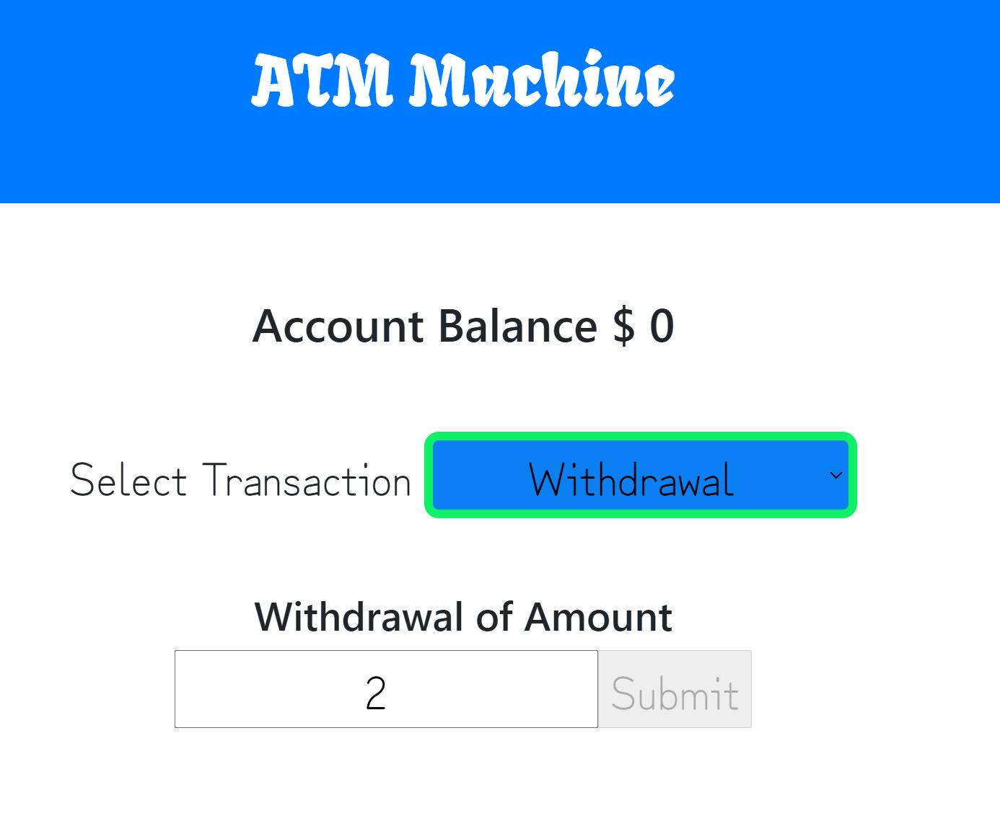

# ATMMachine
# Name: ATM Machine

## Description: 
ATM Machine is a react program to perform deposit and withdrawals on an account. The improvements made to the base version are -
1. UI changes include bootstrap, CSS Styling - button, fonts, spacing
2. Disable submit on entering negative/zero deposit amount and display appropriate message

## Installation: 
1. Download the project to your desktop. If zipped, unzip it. 
2. Run 'http-server -c-1' on the command promopt (If you do not have http setup, use npm i http-server to install it.)
2. Open standalone.html file in a browser by navigating to the location using the URL http://localhost:8080/ to track your todo list. 

## Usage: 
Use this project to play with React features like react hooks.

## Support: 
There are many support portals available for JavaScript like MDN, StackOverflow, etc. You can use this forum to research various styles and ask questions.

## Roadmap: 
The future of this project is to add more account handling features like transaction history. 

## License information: 

See MIT license release in repository.
